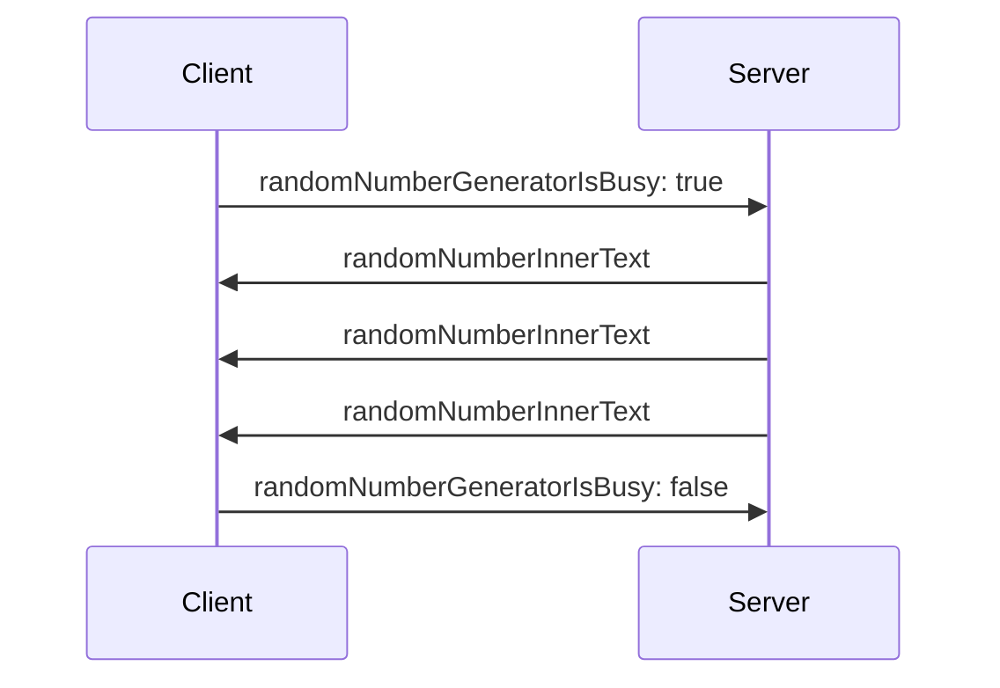

[home](../README.md)

enable the clients to assign


```js
import ListenableBoolean from './ListenableBoolean.js'

export default class extends ListenableBoolean {
    constructor(key, message) {
        super()
        message.addListener(arg => {
            if (arg[key] === undefined) return

            super.assign(arg[key])
        })
    }
}
```

```js
startButtonElement.onclick = () => {
    socket.send(JSON.stringify({ randomNumberGeneratorIsBusy: true }))
}

stopButtonElement.onclick = () => {
    socket.send(JSON.stringify({ randomNumberGeneratorIsBusy: false }))
}
```

## Sequence diagram


## How to run the sample code in this folder
1. open a terminal
1. change directory to this folder
1. type `npm i` in the terminal
1. type `node .` in the terminal
1. open http://localhost in your browser