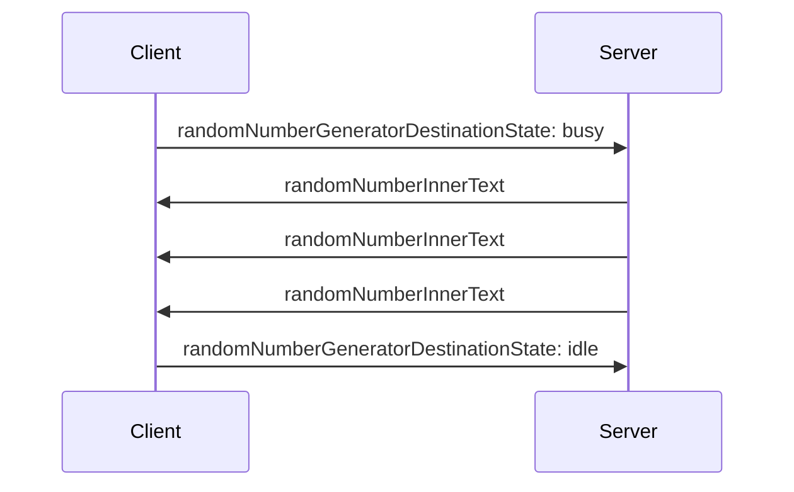

[home](../README.md)

enable the clients to assign

ControllableString.js:
```js
import ListenableString from './ListenableString.js'

export default class extends ListenableString {
    constructor(key, requestParams) {
        super()
        requestParams.addListener(arg => {
            if (!arg.has(key)) return

            super.assign(arg.get(key))
        })
    }
}
```

Client.js:
```js
element.value = 'start'
element.onclick = () => {
    const xhr = new XMLHttpRequest()
    xhr.open('PUT', '/?randomNumberGeneratorDestinationState=busy')
    xhr.send()
}

element.value = 'stop'
element.onclick = () => {
    const xhr = new XMLHttpRequest()
    xhr.open('PUT', '/?randomNumberGeneratorDestinationState=idle')
    xhr.send()
}
```

## Sequence diagram


## How to run the sample code in this folder
1. open a terminal
1. change directory to this folder
1. type `npm i` in the terminal
1. type `node .` in the terminal
1. open http://localhost in your browser
1. click start button
