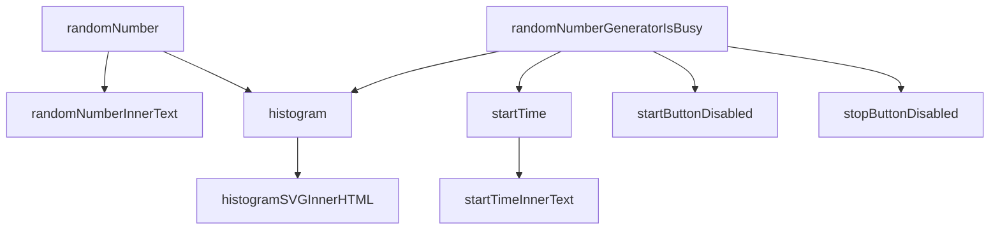

# A Data Acquisition System using JavaScript

## Contents

[01 JavaScript](./01/README.md)

[02 Node.js](./02/README.md)

[03 HTTP](./03/README.md)

[04 setInterval](./04/README.md)

[05 WebSocket](./05/README.md)

[06 Client](./06/README.md)

[07 Listenable](./07/README.md)

[08 Operator](./08/README.md)

[09 Variables](./09/README.md)

[10 Pathnames](./10/README.md)

[11 Element Values](./11/README.md)

[12 Controllable](./12/README.md)

[13 Histogram](./13/README.md)

[14 Time Series](./14/README.md)

[14.a SVG](./14a/README.md)

[14.b HDF5](./14b/README.md)

[14.c Clients](./14c/README.md)

[14.d Cursor](./14d/README.md)

[14.e Overlay](./14e/README.md)

[14.f BlockList](./14f/README.md)

[14.g InfluxDB](./14g/README.md)

[14.h API](./14h/README.md)

[14.h Slow](./14i/README.md)

[14.j Normal Distribution](./14j/README.md)

[14.k Log Scale](./14k/README.md)

[14.l Plot Range](./14l/README.md)

[14.m Preset](./14m/README.md)

[14.n Throttle](./14n/README.md)

## Graph

## References
[MDN Web Docs](https://developer.mozilla.org/en-US/docs/Web/JavaScript)

[Node.js](http://nodejs.org)

[Node.js Design Patterns](https://www.amazon.com/Node-js-Design-Patterns-server-side-applications-ebook/dp/B01D8HIIFU/ref=sr_1_5?crid=2G48L0ELEAJX1&dib=eyJ2IjoiMSJ9.cSwsHQHnnYC2a7zCD9nX_LgwbcpNMc_YAPmWJH32GauuQvav-NXCdE9zVftvm3VJtg9NLX2P68biCiOBsNDbzE9YYVWC749JZrmB3rrXZt-5-TQ6vUYH9RgoEHpnZbr-i0Sqdta5hNrAmzINgYq8JVNlIsBHiNPtNrrWhGiKYiG2nVcEmOqBxqkFNufAVbscJEyP6H0EFsgfC8ie65xlGru6UK0P3HgML5PaJxFhiaU.4_rsQddQqQsvY5qq3Ciy_fhK-2z9z51uHrIkp-SWwms&dib_tag=se&keywords=node+js+design+patterns&qid=1725497456&sprefix=node+js+design+patterns%2Caps%2C294&sr=8-5)

[ws](https://github.com/websockets/ws)

[h5wasm](https://github.com/usnistgov/h5wasm)

[koffi](https://github.com/Koromix/koffi)
