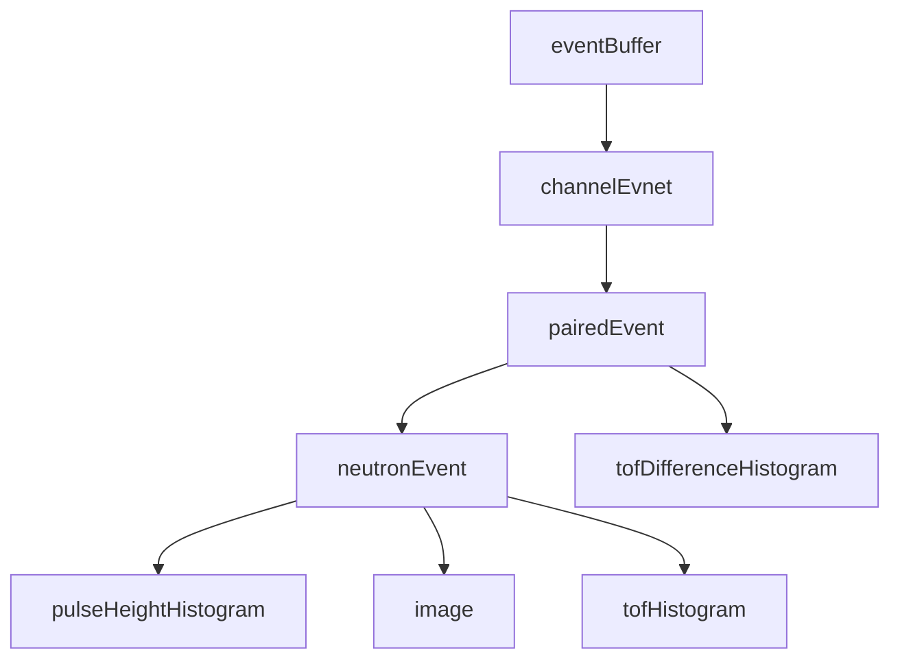

## Graph

```mermaid
graph TD;
    eventBuffer-->channelEvnet;
    channelEvnet-->pairedEvent;
    pairedEvent-->neutronEvent;
    pairedEvent-->tofDifferenceHistogram;
    neutronEvent-->pulseHeightHistogram;
    neutronEvent-->image;
    neutronEvent-->tofHistogram;
```